<!-- profile-refresh: 2026-03-11 -->

  
  

  <code>AI Systems</code>
  <code>Backend</code>
  <code>Automation</code>
  <code>Dark UI</code>

  <strong>Midnight builds. Deep black UI. Systems that stay sharp under load.</strong> 
  Gotham-inspired motion scene for <code>lohith</code>, generated from local SVGs and live public GitHub signals.

  
  
  

  <picture>
    <source media="(prefers-color-scheme: dark)" srcset="https://raw.githubusercontent.com/Lohith-UncovAI/Lohith-UncovAI/output/github-contribution-grid-snake-dark.svg">
    <source media="(prefers-color-scheme: light)" srcset="https://raw.githubusercontent.com/Lohith-UncovAI/Lohith-UncovAI/output/github-contribution-grid-snake.svg">
    
  </picture>

  

